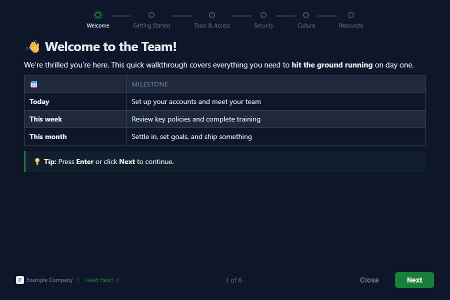

<div align="center">
  

  **Cross-platform onboarding wizard for new hires.** Markdown in, polished wizard out.

  [](https://codecov.io/gh/TsekNet/day1)
  [](https://opensource.org/licenses/MIT)
  [](https://github.com/TsekNet/day1/releases)
</div>

---

<div align="center">
  
</div>

*day1* renders markdown pages as a step-by-step onboarding wizard inside a frameless [Wails v2](https://wails.io) webview. Write pages in markdown, configure everything in `day1.yml`, and every new hire sees a polished first-run experience. Shows once per machine, then gets out of the way.

> **Disclaimer:** This was created as a fun side project (PoC), not affiliated with any company.

## Install

Download and launch the day1 binary from [Releases](https://github.com/TsekNet/day1/releases).

## Quick start

```bash
day1                                # run with built-in demo pages
day1 --pages-dir /path/to/pages     # run with custom content
day1 --force                        # re-show even if completed
```

## Configuration

All settings live in `day1.yml` inside the pages directory:

```yaml
# day1.yml
brand:
  name: Example Company
  logo: assets/brand-logo.png # relative to this directory
title: Welcome
help_url: https://wiki.example.com/onboarding
theme: auto # auto, light, or dark
accent_color: "#188038" # hex color for buttons and progress bar
# final_page: final.md
pages: # display order; only listed pages are shown
  - welcome.md
  - getting-started.md
  - tools-access.md
  - security.md
  - culture.md
  - resources.md
```

Each `.md` file has optional YAML frontmatter for the title and platform filtering:

```markdown
---
title: Day 1
platform: all
---

# Welcome to the Team!

Your onboarding content here.
```

> **Design rule:** Pages do not scroll. Content must fit in one screen.

## CLI

```
day1 [flags]

Flags:
  --pages-dir string   directory containing .md pages and day1.yml (default: built-in)
  --force              show even if already completed
  -v, --verbose        verbose logging to stderr

Subcommands:
  version              print version, commit, build date
```

## Docs

- **[Design](docs/design.md)** -- Frontend spec, markdown format, testing strategy
- **[Architecture](docs/architecture.md)** -- Mermaid diagrams, package map, data flow
- **[Deployment](docs/deployment.md)** -- Run-once triggers per OS

## Contributing

Pull requests are welcome. For major changes, please open an issue first.

```bash
git clone https://github.com/TsekNet/day1.git && cd day1
go test ./internal/... ./cmd/...
```

## License

[MIT](LICENSE)
