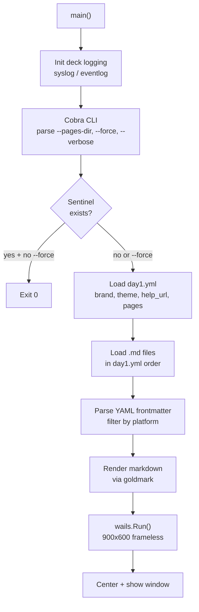
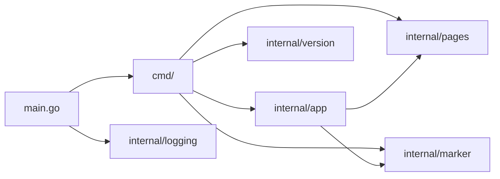
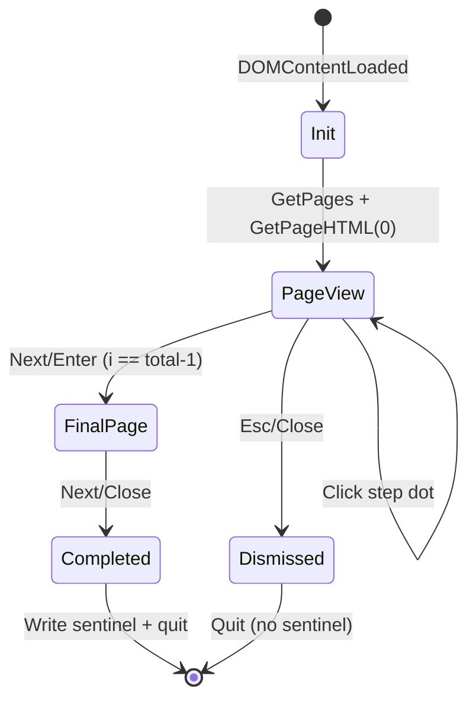
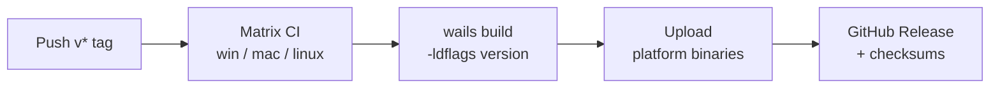

# Architecture

**[← Wiki Home](Home)** · [Design](Design) · [Deployment](Deployment)

---

## Startup Flow

---

## Package Dependency Graph

---

## Page Lifecycle

```mermaid
flowchart LR
    Config["day1.yml\npages list"] --> Ordered["Load in order"]
    Ordered --> MDFile[".md file\non disk"]
    MDFile --> Frontmatter["Parse YAML\nfrontmatter"]
    Frontmatter --> Filter["Filter by\nruntime.GOOS"]
    Filter --> Goldmark["Render HTML\nvia goldmark"]
    Goldmark --> RewriteURLs["Rewrite image\nsrc paths"]
    RewriteURLs --> Cache["Cache in\nApp.rendered"]
    Cache --> Binding["GetPageHTML(i)\nWails binding"]
    Binding --> InnerHTML["Frontend\ninnerHTML"]
```

---

## Frontend State Machine

---

## Build and Release Pipeline

---

## Key Files

| File | Responsibility |
|------|----------------|
| `main.go` | Embeds frontend + demo pages, inits logging, calls `cmd.Execute()` |
| `cmd/root.go` | Cobra root command, loads `day1.yml`, launches Wails |
| `cmd/version.go` | Version subcommand |
| `internal/app/app.go` | Wails App struct, JS bindings, sentinel write on complete, WSL browser workaround |
| `internal/pages/config.go` | Parse `day1.yml` (brand, theme, accent_color, help_url, pages order, final_page) |
| `internal/pages/loader.go` | Load `.md` files in `day1.yml` order or auto-discover, platform filtering |
| `internal/pages/page.go` | Frontmatter parsing, goldmark rendering, image URL rewriting |
| `internal/marker/marker.go` | Sentinel file check/write/remove |
| `internal/logging/unix.go` | Syslog backend for macOS/Linux |
| `internal/logging/windows.go` | Event Log backend for Windows |
| `internal/version/version.go` | Version/Commit/Date vars (ldflags) |
| `frontend/index.html` | HTML structure: brand, progress bar, content area, nav |
| `frontend/style.css` | Light/dark theme, markdown typography, no-scroll design |
| `frontend/main.js` | Wails bindings, navigation, keyboard handlers, theme application |
